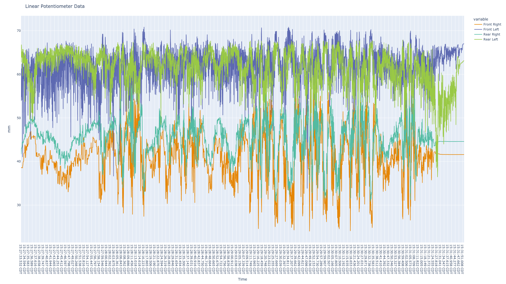
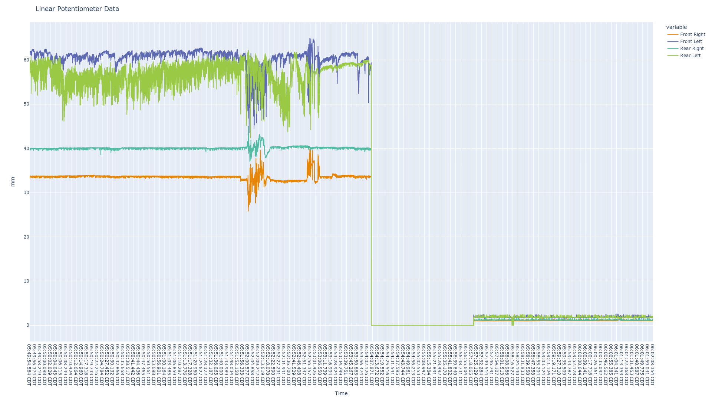

# Various Scripts and Files for FSAE Race Car Analysis

Note this repo is not heavily used yet, so not all analysis is here.  

Currently have not implemented any filtering and this data is from 09/30/2023 and 10/1/2023, so behind the recent updates to resolution. Left side refers to drivers right, this will be changed in future version.  

## On Track Data  

## Idling, Can see the Imact EMI has on the Side Left

The drop is from loss of power to the linear potentiometers.  

